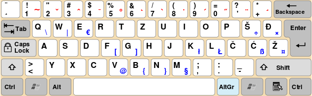

QWERTZ South Slavic Latin
=========================

The [QWERTZ South Slavic Latin][SSL] keyboard layout for OS X.
This keyboard layout was standardized in the 1980s in Yugoslavia
and is used in Windows and Linux PCs for Bosnian, Croatian, Serbian Latin
and Slovene. Macs have a different layout for these languages,
which can be troublesome for people used to the PC layout.
Using this layout makes things a bit more familiar,
e.g. `@` is at its usual location. The layout aspires to be:

To install:

    sudo cp -R "South Slavic Latin.bundle" "/Library/Keyboard Layouts/"

Then restart the computer and to add the layout, go to
System Preferences - Keyboard - Input Sources - `+` - start typing "south",
select "South Slavic Latin" - Add. Now you should be able to select this layout
from the keyboard menu bar icon (or it will be automatically selected if you
remove other layouts).

## Features

So far most of the keys should be in their right places, including:

 - `@` can be found at `alt` + `v`
 - state modifiers like `alt` + `<number>`, `a` for inputing other international
   characters such as ä, á or à
 - often used programming keys like `<`, `>`, `[`, `]`, `{` and `}`
 - we don't need to mention where ć, č, ž, š and đ are, right?

### Typography

We made some customisations by adding some typographic keys that were not easily
accessible in the original PC layout. The modifiers for `z`, `u`, `i`, `o`, `p`
keys were used to map these keys, since they were not used in the original.

<table>

<tr>
    <td>em dash</td> <td>—</td> <td>`alt`+`z`</td>
</tr>
<tr>
    <td>en dash</td> <td>–</td> <td>`alt`+`z`</td>
</tr>
<tr>
    <td>ellipsis</td> <td>…</td> <td>`alt`+`č`</td> <td>`alt`+`;`</td>
</tr>
<tr>
    <td>single quotes</td> <td>‘’</td> <td>`alt`+`đ`, `alt`+`shift`+`đ` </td> <td>`alt`+`]`, `alt`+`shift`+`]` </td>
</tr>
<tr>
    <td>double quotes</td> <td>–</td> <td>`alt`+`š`, `alt`+`shift`+`š` </td> <td>`alt`+`[`, `alt`+`shift`+`[` </td>
</tr>

</table>

## Hacking

The layout is created using [Ukelele](http://scripts.sil.org/ukelele),
the free Unicode Keyboard Layout Editor. You can get it using Homebrew Cask
to edit the layout:

    brew cask install ukelele

Icon generated using: <https://iconverticons.com/online/>

Edit the .keylayout and .icns files in the root of the repo and update
the .bundle by bumping its version number and running the update script
which copies the files inside it.

    ./update-bundle.sh

Feel free to improve the layout and submit a pull request!

Živjeli!

[SSL]: https://en.wikipedia.org/wiki/QWERTZ#South_Slavic_Latin
